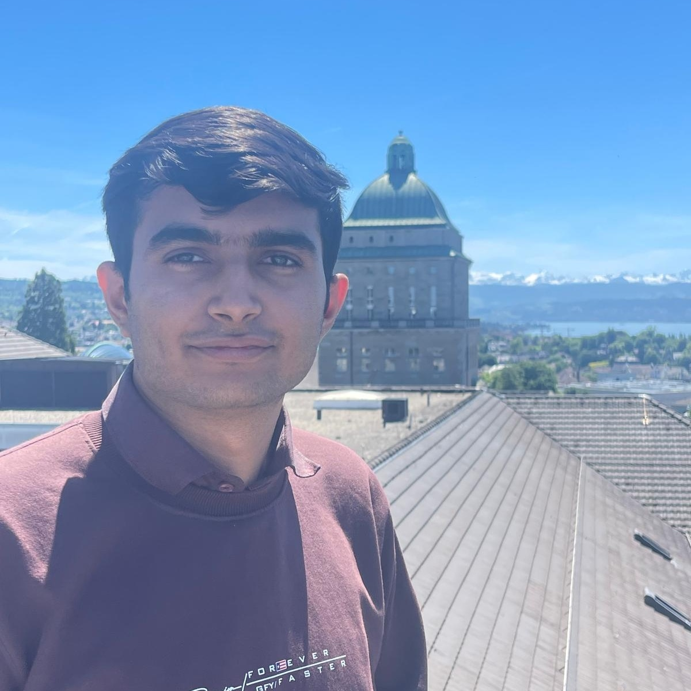

  
  

    I am Devansh Tripathi, an applied mathematics student at Indian Institute of Science Education and Research 
    <a href="https://www.iisertvm.ac.in">[IISER]</a>, Thiruvananthapuram in Kerala, India. I am currently in 4th year of integrated BS-MS degree. I am particularly interested in computational partial differential equations (PDEs), mathematical analysis of PDEs and deep learning. Email: devansh22 (at) iisertvm (dot) ac (dot) in
  

  

### On-going 

I am currently a project mobility student at [ETH Zurich](https://ethz.ch/en.html), Switzerland. I will be working on mathematical analysis of Neural Operators and their applications in computational PDEs with [Prof. Dr. Siddhartha Mishra](https://camlab.ethz.ch/the-group/group-head.html) at [CAMLab](https://camlab.ethz.ch/).

## Research
My research interests include:  

- Numerical Solution of ODEs/PDEs 
- Mathematical Analysis of Deep Learning, Neural Operators 
- Parallel Computing  
- Machine Learning

## Achievements/Fellowships

- [Awarded ETH for Development Fellowship, 2024](one-pager/eth4d.md)
- [Awarded Summer Student Research Programme (SSRP), 2024](one-pager/ssrp_tifrcam.md)
- [Awarded INSPIRE Scholarship for Higher Education (SHE), 2022](one-pager/inspire_she.md)

## Presentation
Here are some of my recent presentation:  

1. [Distributed memory parallelization of Lax-Wendroff Flux Reconstruction](https://github.com/Devansh1106/internship_tifr_cam2024/blob/main/Presentation_TIFR_internship.pdf){target=_blank}, on August 11, 2024 at TIFR-CAM, Bangalore, India (online).

## Some random pictures

- You can view all the pictures from my ETH Zurich, Switzerland visit [here on Google drive](https://drive.google.com/drive/u/0/folders/1eL0GdKCOjVxanKDfvhZueiFx6iIo2wgF).

- [Board in my office at ETH](assets/board.jpg): It has a mixture of topics going on it + serves as my TODO.
- View from my Office at ETH: [Pic1](assets/schweiz/IMG_20250605_193728.jpg)
- The Limmat: [Pic1](assets/schweiz/IMG_20250522_170132.jpg); [Pic2](assets/schweiz/IMG_20250515_184258.jpg); [Pic3](assets/schweiz/IMG_20250522_165358.jpg)
- View from terrace of ETH Zentrum: [Pic1](assets/schweiz/IMG_20250530_123842.jpg); [Pic2](assets/schweiz/IMG_20250530_123839.jpg)

## Contact
Feel free to write an email to me [here](mailto:devansh22@iisertvm.ac.in){target=_blank}, I enjoy email conversations!